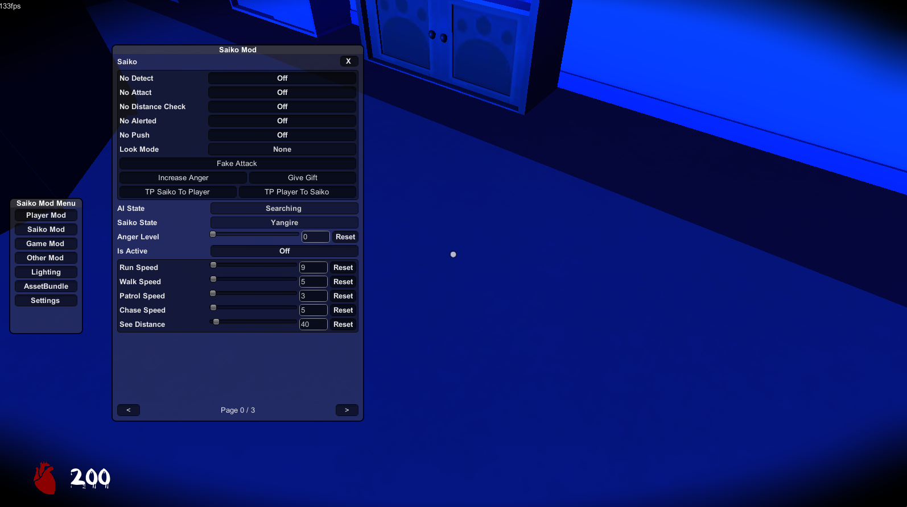

> [!IMPORTANT]
> Set "Disable EventSystem override" to `false` In [UnityExplorer](https://github.com/yukieiji/UnityExplorer) for avoid breaking EventSystem.

# Saiko No Sutoka Mod Menu
A Mod Menu Utility for Saiko No Sutoka Alpha 2.0.

## Installation
1. Download Saiko No Sutoka 2.0 on Itch.io, you can find "Saikonosutoka_2.0_OLD" on "Download demo" section. [Link](https://habupain.itch.io/saiko-no-satuka), **NOT** in steam.
2. Download [BepinEx](https://github.com/BepInEx/BepInEx/releases). Optionally, You can download [UnityExplorer](https://github.com/yukieiji/UnityExplorer/releases).
3. Unzip BepinEx and put `Saikonosutoka201` Folder.
4. (OPTIONAL) Unzip UnityExplorer and put `Saikonosutoka201/BepinEx/plugins` folder.
5. Download SaikoMenu and put `Saikonosutoka201/BepinEx/plugins` folder.