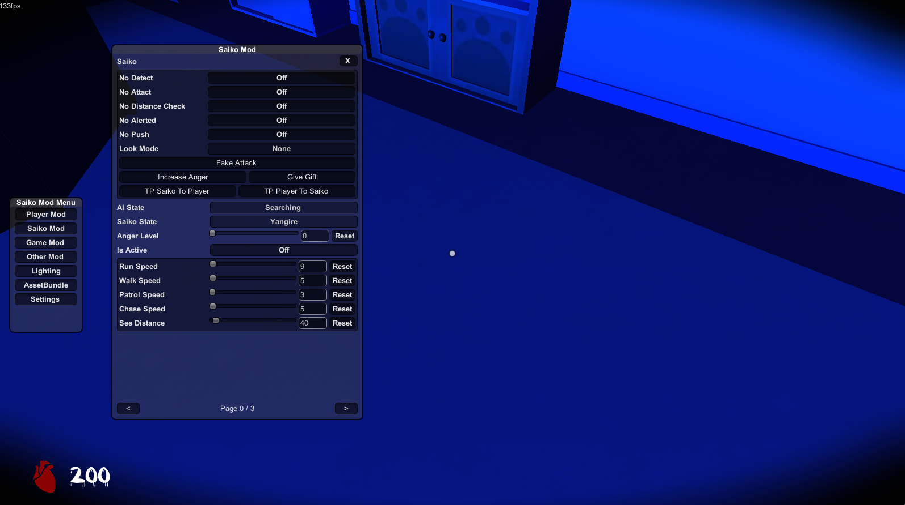

# Saiko No Sutoka Mod Menu
A Mod Menu for **Saiko No Sutoka Alpha 2.0**.

> [!IMPORTANT]
> If you use [UnityExplorer](https://github.com/yukieiji/UnityExplorer), set **Disable EventSystem override** to `false`. Otherwise, the EventSystem may stop working correctly.

## Installation
1. **Install Saiko No Sutoka Alpha 2.0.**  
   Download `Saikonosutoka_2.0_OLD` from the **Download demo** section on [itch.io](https://habupain.itch.io/saiko-no-satuka). Use this version rather than the Steam release.
2. **Install BepInEx.**  
   Download a release from the [BepInEx releases page](https://github.com/BepInEx/BepInEx/releases).
3. **Extract BepInEx.**  
   Extract the BepInEx files into the `Saikonosutoka201` game folder.
4. **(Optional) Install UnityExplorer.**  
   Download [UnityExplorer](https://github.com/yukieiji/UnityExplorer/releases) and extract its files into `Saikonosutoka201/BepInEx/plugins`.
5. **Install SaikoMenu.**  
   Place the SaikoMenu files in `Saikonosutoka201/BepInEx/plugins`.